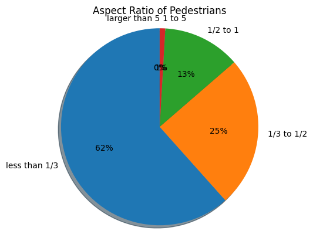
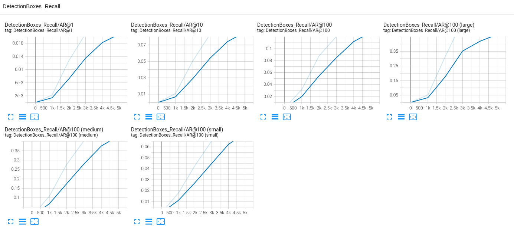
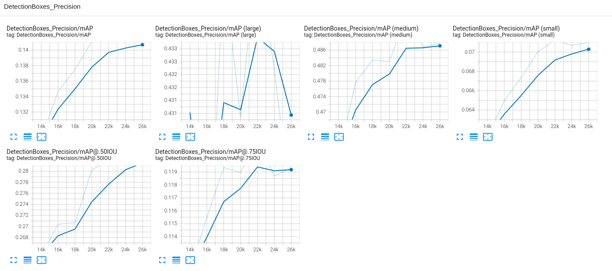

# Object Detection in an Urban Environment

## Submission 

### Project overview
This project is to develop a deep learning model to detect vehicles, pedestrians and cyclists in an urban environment by a single image.

### Set up
I use my local laptop for this project since the Udacity workspace always complains about a lack of space after 3500 steps of training.

### Local Setup

For local setup if you have your own Nvidia GPU, you can use the provided Dockerfile and requirements in the [build directory](./build).

Follow [the README therein](./build/README.md) to create a docker container and install all prerequisites.

### Download and process the data

**Note:** ”If you are using the classroom workspace, we have already completed the steps in the section for you. You can find the downloaded and processed files within the `/home/workspace/data/preprocessed_data/` directory. Check this out then proceed to the **Exploratory Data Analysis** part.

The first goal of this project is to download the data from the Waymo's Google Cloud bucket to your local machine. For this project, we only need a subset of the data provided (for example, we do not need to use the Lidar data). Therefore, we are going to download and trim immediately each file. In `download_process.py`, you can view the `create_tf_example` function, which will perform this processing. This function takes the components of a Waymo Tf record and saves them in the Tf Object Detection api format. An example of such function is described [here](https://tensorflow-object-detection-api-tutorial.readthedocs.io/en/latest/training.html#create-tensorflow-records). We are already providing the `label_map.pbtxt` file.

You can run the script using the following command:
```
python download_process.py --data_dir {processed_file_location} --size {number of files you want to download}
```

You are downloading 100 files (unless you changed the `size` parameter) so be patient! Once the script is done, you can look inside your `data_dir` folder to see if the files have been downloaded and processed correctly.

### Classroom Workspace

In the classroom workspace, every library and package should already be installed in your environment. You will NOT need to make use of `gcloud` to download the images.


### Create the training - validation splits
In the class, we talked about cross-validation and the importance of creating meaningful training and validation splits. For this project, you will have to create your own training and validation sets using the files located in `/home/workspace/data/waymo`. The `split` function in the `create_splits.py` file does the following:
* create three subfolders: `/home/workspace/data/train/`, `/home/workspace/data/val/`, and `/home/workspace/data/test/`
* split the tf records files between these three folders by symbolically linking the files from `/home/workspace/data/waymo/` to `/home/workspace/data/train/`, `/home/workspace/data/val/`, and `/home/workspace/data/test/`

Use the following command to run the script once your function is implemented:
```
python create_splits.py --source data/waymo/processed --destination data
```

### Edit the config file

Now you are ready for training. As we explain during the course, the Tf Object Detection API relies on **config files**. The config that we will use for this project is `pipeline.config`, which is the config for a SSD Resnet 50 640x640 model. You can learn more about the Single Shot Detector [here](https://arxiv.org/pdf/1512.02325.pdf).

First, let's download the [pretrained model](http://download.tensorflow.org/models/object_detection/tf2/20200711/ssd_resnet50_v1_fpn_640x640_coco17_tpu-8.tar.gz) and move it to `/home/workspace/experiments/pretrained_model/`.

We need to edit the config files to change the location of the training and validation files, as well as the location of the label_map file, pretrained weights. We also need to adjust the batch size. To do so, run the following:
```
python edit_config.py --train_dir /home/workspace/data/train/ --eval_dir /home/workspace/data/val/ --batch_size 8 --checkpoint /home/workspace/experiments/pretrained_model/ssd_resnet50_v1_fpn_640x640_coco17_tpu-8/checkpoint/ckpt-0 --label_map /home/workspace/experiments/label_map.pbtxt
```
A new config file has been created, `pipeline_new.config`.

### Dataset
#### Exploring dataset
|   |   |
:-------------------------:|:-------------------------:
|   |   |

#### Dataset analysis

There are 3k random samples used for analysis.

**Distribution of classes**

Dataset is very imblanced in terms of number of samples available for each class. Class 1 of vehicles have maximum samples. Class 4 of cyclists is very rare in the dataset, followed by Class 2 of pedestrians.


**Aspect ratio of bounding boxes**
For the anchor based object detection method, the shape of the default anchors has a big contribution for the performance of the model. Analysis the aspect ratio of different classes might help to design a better shape of the default anchors. The aspect ratio is calculated by width/height of each bounding box. The shape is categoried to 5 range: less than 1/3, 1/3 to 1/2, 1/2 to 1, 1 to 5, larger than 5. 

For vehicles, 54% aspect ratio is 1/2 to 1 and 36% aspect ratio is 1 to 5. 
    

For pedestrians, 62% aspect ratio is less than 1/3, 25% aspect ration is 1/3 to 1/2 and 13% is 1/2 to 1. 



For cyclists, 44% is less than 1/3, 29% is less than 1/2 to 1 and 29% is 1/2 to 1. 
    


### Training

Since the GPU memory of my laptop is limited. I cannot run training and evaluate at the same time. I can only run evaluation after the training job is done. By default, when running experiments/model_main_tf2.py for evaluation, only the last saved checkpoint is loaded. I added another option eval_all and a method called eval_all_checkpoints to experiments/model_main_tf2.py. If eval_all option is enabled, all saved checkpoints are evaluated. 

#### Reference experiment


The reference model is trained with the batch size 2 and the learning rate is adjusted to 0.00005. The total step is set to 5000. The optimizer is SGD with momentum. The learning rate decay is cosine anealing.   

Model and training hyperparameters are defined using a file, pipeline_new.config.
You can make changes in this config file, then move the `pipeline_new.config` to the `/home/workspace/experiments/reference` folder. Now launch the training process:
* a training process:
```
python experiments/model_main_tf2.py --model_dir=experiments/reference/ --pipeline_config_path=experiments/reference/pipeline_new.config
```
Once the training is finished, launch the evaluation process:
* an evaluation process:
```
python experiments/model_main_tf2.py --model_dir=experiments/reference/ --pipeline_config_path=experiments/reference/pipeline_new.config --checkpoint_dir=experiments/reference/
```


For the reference pipeline file, the mAP for IoU=0.50:0.95 is 0.092 and the mAP for IoU=0.50 is 0.183.




#### Improve on the reference
To improve the performance, I applied many different augmentations. Meanwhile, the learning rate is adjusted to 0.001333 and the warmup learning rate is set to 0.0004.With these settings, the mAP for IoU=0.50:0.95 is improved to 0.120 and the mAP for IoU=0.50 is 0.25. I then use another pipeline file with a larger training step ( 26000 instead of 5000), A model trained with this new pipeline has a better performance. The mAP for IoU=0.50:0.95 is 0.142 and the mAP for IoU=0.50 is 0.282.
* a training process:
```
python experiments/model_main_tf2.py --model_dir=experiments/experiment3/ --pipeline_config_path=experiments/experiment3/pipeline_new.config
```





 
**Augmentation strategies:**
1. random_horizontal_flip
2. random_crop_image
3. random_adjust_brightness
4. random_adjust_contrast
5. random_adjust_hue
6. random_adjust_saturation
7. random_distort_color


|   |   |
:-------------------------:|:-------------------------:
|   |   |


### Creating an animation

#### Export the trained model

Modify the arguments of the following function to adjust it to your models:

```
python experiments/exporter_main_v2.py --input_type image_tensor --pipeline_config_path experiments/experiment3/pipeline_new.config --trained_checkpoint_dir experiments/experiment3/ --output_directory experiments/experiment3/exported/
```

This should create a new folder `experiments/reference/exported/saved_model`. You can read more about the Tensorflow SavedModel format [here](https://www.tensorflow.org/guide/saved_model).

Finally, you can create a video of your model's inferences for any tf record file. To do so, run the following command:
```
python inference_video.py --labelmap_path label_map.pbtxt --model_path experiments/experiment3/exported/saved_model --tf_record_path data/test/segment-12012663867578114640_820_000_840_000_with_camera_labels.tfrecord --config_path experiments/reference/pipeline_new.config --output_path images/animation1.gif
```
```
python inference_video.py --labelmap_path label_map.pbtxt --model_path experiments/experiment3/exported/saved_model --tf_record_path data/test/segment-12200383401366682847_2552_140_2572_140_with_camera_labels.tfrecord --config_path experiments/reference/pipeline_new.config --output_path images/animation2.gif
```

```
python inference_video.py --labelmap_path label_map.pbtxt --model_path experiments/experiment3/exported/saved_model --tf_record_path data/test/segment-1208303279778032257_1360_000_1380_000_with_camera_labels.tfrecord --config_path experiments/reference/pipeline_new.config --output_path images/animation3.gif
```

<!-- ## Test results


 -->